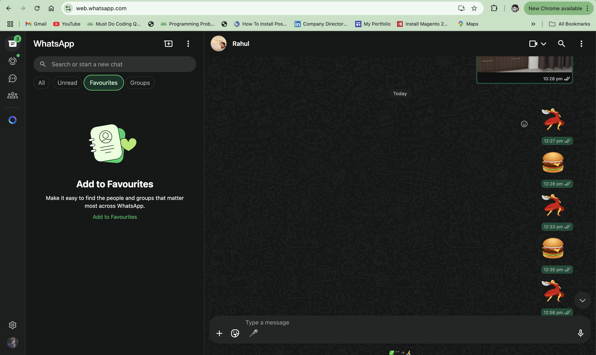
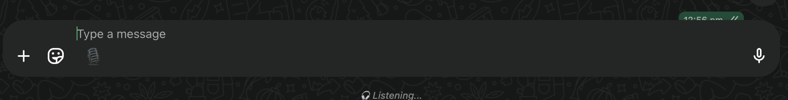
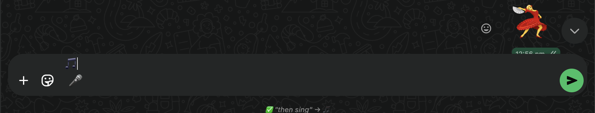

# 🎤 Voice-to-Emoji for WhatsApp Web — Chrome Extension

Say it. Feel it. Emoji it.
🎙️➡️🧠➡️😄
This Chrome extension turns your voice into expressive emojis — directly inside WhatsApp Web!

## 🌟 What's Unique?

Unlike standard messaging apps like WhatsApp, Telegram, or Instagram, which offer:

- 🎤 Voice Notes
- 📝 Speech-to-Text

## 👷 We’re building the first-of-its-kind:

👉 Speech-to-Emoji

Example:

“I’m dancing” → 💃

“I’m eating pizza” → 🍕

“Feeling happy” → 😊

## 🧠 Only the emoji is inserted and sent.
- No voice recording. No text. Pure emotion.

## ✅ Key Features

- 🎧 Real-time Offline Voice Recognition (via Vosk)

- 🧠 Intent Understanding using BERT (HuggingFace Transformers)

- 😄 Emoji Suggestion using Semantic Similarity

- 🧩 Injected directly inside WhatsApp Web via Chrome Extension

- 💬 Auto-sends emoji in chat (without typing)

## 🛠️ Tech Stack 

```
| Component                | Tech Used                    | Role                                         |
|--------------------------|------------------------------|----------------------------------------------|

| 🎤 Speech Recognition    | Vosk                         | Converts microphone input into offline text  |

| 🧠 NLP & Intent Matching | BERT (HuggingFace) + PyTorch | Understands user speech                      |

| ➗ Similarity Matching   | NumPy                        | Matches text with emoji keywords             |

| ⚙️ Backend                | FastAPI                      | `/listen` endpoint for voice analysis        |

| 💬 Frontend              | Chrome Extension + JS        | Injects mic button and handles emoji display |

```

## 🧠 Architecture Flow
```
graph TD;
    A[🎤 User Clicks Mic in WhatsApp] --> B[Mic Audio Recorded];
    B --> C[Vosk: Speech-to-Text (Offline)];
    C --> D[BERT Embedding];
    D --> E[Cosine Similarity];
    E --> F[Emoji Mapped 🎉];
    F --> G[Emoji Inserted & Sent in WhatsApp];

```
## 🚀 Setup Instructions
🔧 1. Clone the Repository
```
git clone https://github.com/rohitmishr/Speech-to-emoji.git

cd Speech-to-emoji
```
🐍 2. Backend Setup (FastAPI + AI)
```
✅ Create Virtual Environment

python3 -m venv emoji-ai-env

source emoji-ai-env/bin/activate
```
```
✅ Install Python Dependencies

pip install -r requirements.txt
```
```
✅ Download and Prepare Vosk Model

curl -LO https://alphacephei.com/vosk/models/vosk-model-en-us-0.22.zip

unzip vosk-model-en-us-0.22.zip

mkdir models

mv vosk-model-en-us-0.22 models/
```
```
✅ Run the FastAPI Server

python run.py

# Open in browser: http://localhost:8000

```
## 🧩 3. Chrome Extension Setup
```
✅ Navigate to Chrome Extensions:

Visit: chrome://extensions/

Enable: Developer Mode

Click: “Load unpacked”

Select the chrome-extension/ folder from this project.

The extension will inject a 🎤 mic icon inside WhatsApp Web chat.
```

## 🎙️ How to Use
```
Open WhatsApp Web

Go to any chat.

Tap the green 🎤 mic icon next to your message box.

Speak something like:

“Let’s party” → 🎉

“I love dogs” → 🐶

“Flying to Paris” → ✈️

The extension:

Records short audio

Sends it to the backend

Receives emoji

Injects emoji into chat

Auto-clicks send ✅
```

## 📚 AI Tools Used:

- 🔊 Vosk – Lightweight offline speech recognition

- 🧠 BERT – Natural Language Understanding (via Transformers)

- ➗ Cosine Similarity – Vector-based emoji matching

- 🧩 JavaScript DOM Injection – Custom Chrome Extension logic

## 🌍 Future Enhancements

- 🌐 Multilingual support

- 🔁 Emoji combos ("pizza and party" → 🍕🎉)

- 📲 Integration with Telegram, Slack

- 🤖 Add context-aware suggestions (e.g., "I'm tired" → 😴)

- 🥳 Why It’s Cool
```
Platform	Feature
WhatsApp	Voice Notes / Speech-to-Text
This Project	Voice-to-Emoji (no text/voice)

Talk less, express more.
Let emojis speak for you. 💬 ➡️ 😄
```


## Result:
- Open whatsapp Web



- Tap to mic in chat section (Listening......)




- Recognize Emoji & send


## 🤝 Contributing
Feel free to fork, star ⭐, and open PRs.

This project is for expressive humans.
Let's bring emotion back into messaging. 🫶

